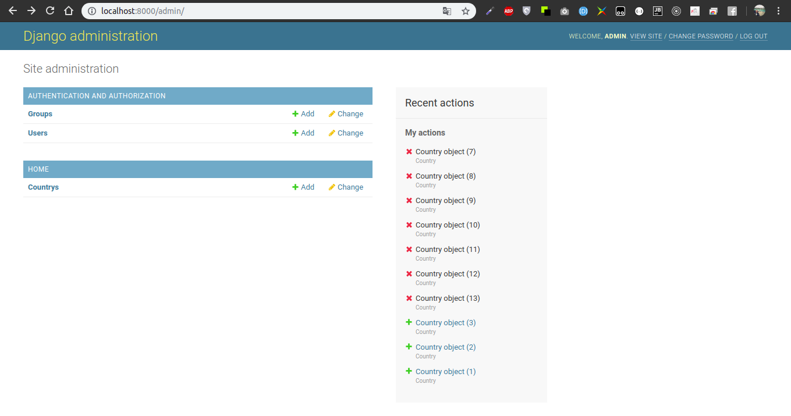

#### uruchomienie wirtualnego środowiska:
```
. env/bin/activate
```

#### uruchomienie serwera:
```
python3 manage.py runserver
```

#### utworzenie nowej strony:
```
python3 manage.py startapp home
```

#### wykorzystane linki:
Population API:
* https://restcountries.eu/
* https://restcountries.eu/rest/v2/all
* https://restcountries.eu/rest/v2/alpha/col

Corona images:
* https://rapidapi.com/astsiatsko/api/coronavirus-monitor

Covid-19 stats:
* https://rapidapi.com/KishCom/api/covid-19-coronavirus-statistics

#### users
admin : private123
user  : user1122